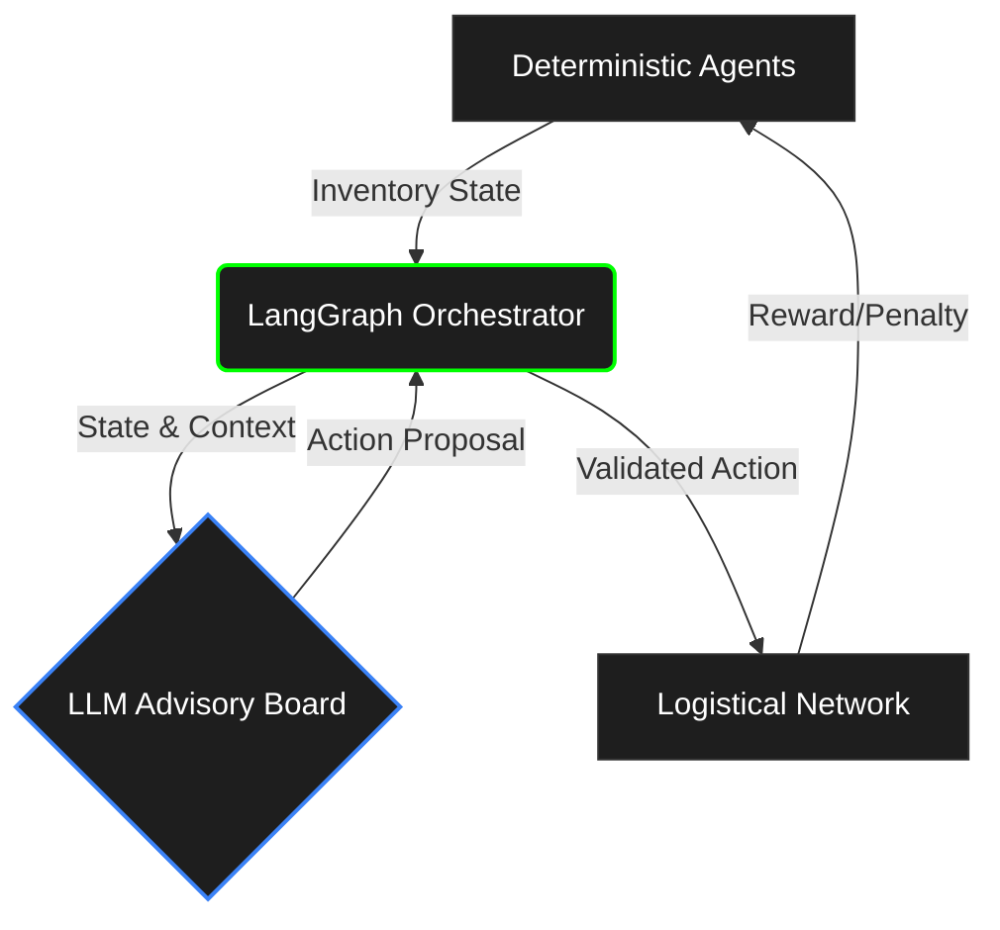
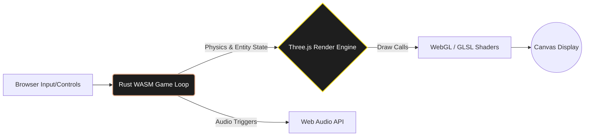
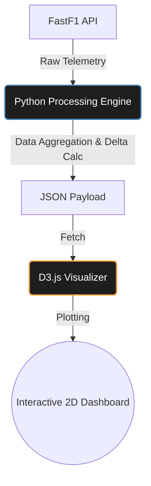
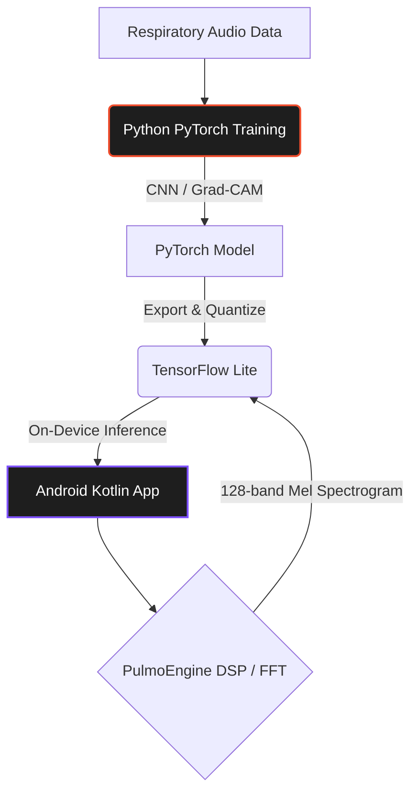
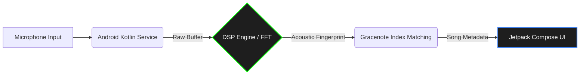

  
  
  

 

  

---

# About Me
Hi, I am **Priyanshu Pratik** — an AI & Data Science student at **Gati Shakti Vishwavidyalaya** and an AI Engineering Intern at **BISAG-N**.

I specialize in building intelligent systems, ranging from deploying custom PyTorch models to Android via TensorFlow Lite (**PulmoSense**), to engineering real-time acoustic fingerprinting DSP engines (**Aura**). Currently, I'm developing an Agentic Supply Chain simulator using LangGraph and Generative AI to mitigate logistical bullwhip effects. 

Beyond backend data processing, I love building highly creative, performant interactive environments like WebGL 3D flight simulators (**Vector Squadron**) and real-time Formula 1 telemetry visualizers. I'm actively preparing for the GATE 2027 (DA) paper and have solved over 160+ algorithmic problems on LeetCode.

---

<table width="100%">
  <tr>
    <td width="40%" valign="top" align="center">
      <h3>Profile</h3>
      <!-- Make sure Priyanshu.svg is uploaded to the root of your Ppratik765 repository -->
      
         
      <h3>Core Technologies</h3>
      <a href="https://skillicons.dev">
        <!-- Perfect 4x6 grid (24 icons) to fit beautifully inside this narrow left column -->
        
      </a>
    </td>
    <td width="60%" valign="top" align="center">
      <h3>GitHub Analytics</h3>
      <!-- This links to the SVG generated by the metrics script in your new profile repo -->
      <picture>
        
      </picture>
    </td>
  </tr>
</table>

---

## System Architecture

  
<b>Agentic Supply Chain Simulator</b>

   
  
  
    
  <i>Engineered during my tenure as an AI Engineering Intern at <b>BISAG-N</b>.</i> 
  

  
<b>Vector Squadron (Rust/WASM + WebGL)</b>

   
  
  
   
  

  
<b>Beyond the Apex (F1 Telemetry Engine)</b>

   
  
  
   

  
<b>PulmoSense (Deep Learning to Edge)</b>

   
  
  
   

  
<b>Aura (Acoustic Fingerprinting)</b>

   
  
  
   

---

## Engineering Deep Dives

  
<b>How I optimized PulmoSense for Real-Time Edge Inference</b>

   
  
  
    
  <b>The Challenge:</b> Running heavy audio processing models on low-power Android devices without significant battery drain or latency.  
  <b>The Solution:</b> I engineered a custom processing engine (<b>PulmoEngine</b>) in Kotlin that computes 128-band Mel spectrograms natively from raw audio buffers using Fast Fourier Transforms (FFT). Instead of relying on a Python backend API, I trained a custom PyTorch model, converted it to <b>TensorFlow Lite</b>, and deployed it directly on-device. This achieved 100% offline, real-time diagnostic classification of respiratory patterns.

  
<b>Aura: Real-Time Acoustic Fingerprinting</b>

   
  
  
    
  Designed a fault-tolerant Android audio identifier capable of "Query by Humming" melody matching. The system uses a highly reactive <b>Jetpack Compose</b> UI following MVVM architecture. The core DSP engine utilizes Fast Fourier Transforms to generate acoustic fingerprints, which are cross-referenced with a catalog index for instant song accessibility.

  
<b>Vector Squadron & Waveglider: Circumventing Browser Bottlenecks</b>

  
  <b>Vector Squadron:</b>   
  <b>Waveglider:</b>  
    
  <b>The Solution:</b> I shifted all heavy game loop logic, autopilot behaviors, and entity physics into <b>Rust</b>, compiling it to <b>WebAssembly (WASM)</b>. This memory-safe, high-performance binary communicates with a custom <b>Three.js</b> and <b>GLSL</b> rendering pipeline, allowing the browser to render infinite oceanic Gerstner waves and vast procedural flight environments seamlessly.

  
<b>Beyond the Apex: Real-Time Formula 1 Analytics</b>

   
  
  
    
  <b>The Challenge:</b> Processing massive arrays of multi-driver, lap-by-lap telemetry data into a consumable, interactive format.  
  <b>The Solution:</b> Developed a robust Python backend utilizing the <b>FastF1 API</b> to extract raw racing metrics. I engineered a pipeline to calculate delta metrics across speed and gear transitions, mapping this payload to a responsive <b>D3.js</b> frontend. This enables users to generate complex 2D comparative visualizations across racing sessions instantaneously.

  
<b>LocalPDF Pro: Offline-First Utility</b>

   
  
  
  
    
  <b>The Challenge:</b> Providing secure PDF processing capabilities without relying on third-party cloud infrastructure or risking metadata leakage.  
  <b>The Solution:</b> Engineered a 100% offline desktop application (PyQt6) and mobile utility (Kotlin). I integrated a <b>Web Assembly</b> sandbox container leveraging <b>PDF.js</b> to compile and parse documents locally, ensuring absolute data privacy and standalone execution.

---

## Live LeetCode Stats
<!-- Idea 5: Automated LeetCode Ticker -->
<!-- IMPORTANT: Replace "Ppratik765" with your actual LeetCode username below! -->

  

